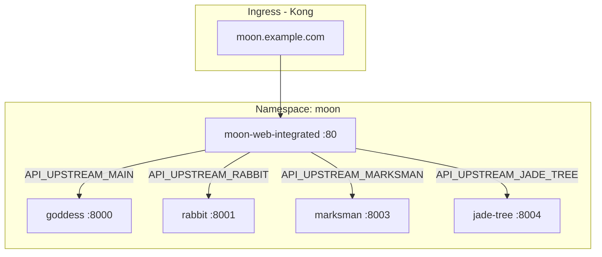

# Moon Web Kubernetes 部署指南

本目录包含 Moon **前端**在 Kubernetes 上的部署清单。与后端仓库 `moon/deploy/k8s` 共用命名空间 **`moon`**，前端 nginx 将 `/v1` 等请求代理到同命名空间内的后端 Service。

镜像由 GitHub Actions 在推送 `v*` tag 时自动构建，推送到 GHCR：`ghcr.io/aide-family/moon-web/<app>:<tag>`。

## 镜像说明

| 镜像 | 说明 |
|---|---|
| `integrated` | **单一前端**（推荐）：所有页面在一个 bundle，nginx 按路径转发到各后端 |
| `main` | 微前端主壳：goddess 页面内嵌；rabbit/marksman/jade_tree 通过 micro-app 加载 |
| `all` | 微前端 all-in-one：main + `/sub/*` 子应用静态资源在同一 Pod |
| `goddess` / `rabbit` / `marksman` / `jade_tree` | 独立子应用前端，可单独部署 |

## 目录结构

```
deploy/k8s/
├── README.md
├── components/
│   └── image-tags/          # 统一镜像版本（newTag）
├── integrated/              # 单一前端
├── main/                    # 微前端主壳
├── goddess|rabbit|marksman|jade_tree/  # 独立子应用
├── micro-all/               # 微前端 all-in-one
├── micro-composed/          # 拆分微前端的共用 Ingress
└── overlays/                # 推荐部署入口
    ├── integrated/          # 模式 A
    ├── micro-all/           # 模式 B
    ├── micro-split/         # 模式 C
    └── standalone/          # 模式 D
```

## 架构关系



## 前置条件

- Kubernetes 集群可访问，`kubectl` 已配置
- 已安装 **[Kong Ingress Controller](https://docs.konghq.com/kubernetes-ingress-controller/)**，存在 `IngressClass` **`kong`**
- **后端已部署**（创建 `moon` 命名空间及 API Service）：

```bash
# 在 moon 仓库根目录
kubectl apply -k deploy/k8s
```

- （可选）GHCR 镜像为私有时，需配置 `imagePullSecrets`

确认 Kong IngressClass：

```bash
kubectl get ingressclass
```

## 快速开始（推荐：单一前端）

在 **moon-web 仓库根目录**执行：

### 1. 修改镜像版本

编辑 `deploy/k8s/components/image-tags/kustomization.yaml`，将 `newTag` 改为与 GitHub release tag 一致（如 `v0.0.6`）：

```yaml
images:
  - name: ghcr.io/aide-family/moon-web/integrated
    newTag: v0.0.6
  - name: ghcr.io/aide-family/moon-web/main
    newTag: v0.0.6
  # ... 其余镜像同步修改
```

所有 overlay 通过 `components/image-tags` 引用，**只需改这一处**。

### 2. 修改 Ingress 域名

编辑 `deploy/k8s/integrated/ingress.yaml`，将 `moon.example.com` 改为实际域名，按需启用 `tls` 段。

### 3. 预览并部署

```bash
# 预览渲染结果（不实际应用）
kubectl kustomize deploy/k8s/overlays/integrated

# 部署
kubectl apply -k deploy/k8s/overlays/integrated
```

### 4. 验证

```bash
# Pod 状态
kubectl get pods -n moon -l app.kubernetes.io/name=moon-web

# Service
kubectl get svc -n moon | grep moon-web

# Ingress
kubectl get ingress -n moon | grep moon-web

# 集群内探活
kubectl run curl --rm -it --image=curlimages/curl -- \
  curl -s -o /dev/null -w "%{http_code}\n" http://moon-web-integrated.moon.svc.cluster.local/
```

对外访问：将 Ingress 域名解析到 Kong 的 External IP / LoadBalancer，浏览器打开 `https://moon.example.com`。

## 部署模式

根据打包方式选择对应 overlay，**不要混用多种模式**（避免 Ingress / Service 冲突）。

| 模式 | 命令 | 适用场景 | Ingress 域名 |
|---|---|---|---|
| **A. 单一前端**（推荐） | `kubectl apply -k deploy/k8s/overlays/integrated` | 生产默认，一个入口 | `moon.example.com` |
| **B. 微前端 all-in-one** | `kubectl apply -k deploy/k8s/overlays/micro-all` | main + 子应用同 Pod | `moon.example.com` |
| **C. 微前端拆分** | `kubectl apply -k deploy/k8s/overlays/micro-split` | main 与子应用分 Pod | `moon.example.com` |
| **D. 独立域名** | `kubectl apply -k deploy/k8s/overlays/standalone` | 各子应用单独访问 | 见下表 |

### 模式 A：单一前端（integrated）

- 镜像：`ghcr.io/aide-family/moon-web/integrated`
- 部署资源：`moon-web-integrated` Deployment / Service / Ingress
- API 环境变量（已在 Deployment 中配置，可按需覆盖）：

| 环境变量 | 集群内地址 | 后端 Service |
|---|---|---|
| `API_UPSTREAM_MAIN` | `http://goddess:8000` | `goddess` |
| `API_UPSTREAM_RABBIT` | `http://rabbit:8001` | `rabbit` |
| `API_UPSTREAM_MARKSMAN` | `http://marksman:8003` | `marksman` |
| `API_UPSTREAM_JADE_TREE` | `http://jade-tree:8004` | `jade-tree` |

同命名空间内使用短 Service 名即可；nginx 通过 Pod 内 Cluster DNS 在请求时解析（见 `docker-entrypoint.sh`）。

```bash
kubectl apply -k deploy/k8s/overlays/integrated
kubectl rollout status deployment/moon-web-integrated -n moon
```

### 模式 B：微前端 all-in-one

- 镜像：`ghcr.io/aide-family/moon-web/all`（由 `docker/Dockerfile.all` 构建，CI 默认未推送，可先本地 `pnpm run docker:build:all:micro`）
- 子应用静态资源挂载在 `/sub/rabbit`、`/sub/marksman`、`/sub/jade_tree`

```bash
kubectl apply -k deploy/k8s/overlays/micro-all
```

### 模式 C：微前端拆分

- 部署 `main` + `rabbit` + `marksman` + `jade_tree` 四个前端 Pod
- 共用 `micro-composed` Ingress，同域名下按路径分流

**注意**：CI 独立子应用镜像默认 `base: /`，拆分模式要求子应用以 `VITE_APP_BASE=/sub/{app}/` 构建（见 `pnpm run build:all:micro`）。否则 iframe 资源路径不匹配。

```bash
kubectl apply -k deploy/k8s/overlays/micro-split
```

### 模式 D：各应用独立域名

同时部署 main、goddess、rabbit、marksman、jade_tree 五个前端，各自独立 Ingress：

| 前端 Ingress 域名 | 前端 Service | 后端 API |
|---|---|---|
| `moon.example.com`（main） | `moon-web-main` | `goddess` :8000 |
| `goddess.moon.example.com` | `moon-web-goddess` | `goddess` :8000 |
| `rabbit.moon.example.com` | `moon-web-rabbit` | `rabbit` :8001 |
| `marksman.moon.example.com` | `moon-web-marksman` | `marksman` :8003 |
| `jade-tree.moon.example.com` | `moon-web-jade-tree` | `jade-tree` :8004 |

**注意**：后端 Ingress 已占用 `goddess.moon.example.com` 等域名指向 API。独立前端若使用相同域名会与后端冲突，请为前端使用不同子域名（如 `web-rabbit.moon.example.com`），或优先使用模式 A。

```bash
kubectl apply -k deploy/k8s/overlays/standalone
```

## 单独部署某个应用

只部署某一个前端组件（需已存在 `moon` 命名空间）：

```bash
# 预览
kubectl kustomize deploy/k8s/rabbit

# 部署（namespace 由 overlay 注入，单独 apply 时需 -n moon）
kubectl apply -k deploy/k8s/rabbit -n moon
```

单独 `kubectl apply -k deploy/k8s/rabbit` 不会自动注入镜像 tag，**推荐通过 overlay 或手动在 components/image-tags 中维护版本后使用 overlay**。

## 拉取私有镜像

```bash
kubectl create secret docker-registry ghcr-secret \
  -n moon \
  --docker-server=ghcr.io \
  --docker-username=<github-user> \
  --docker-password=<github-pat>
```

在对应 `deployment.yaml` 的 `spec.template.spec` 下增加：

```yaml
imagePullSecrets:
  - name: ghcr-secret
```

## 升级镜像

1. 修改 `deploy/k8s/components/image-tags/kustomization.yaml` 中的 `newTag`
2. 重新 apply 对应 overlay：

```bash
# 例如升级到 v0.0.7
kubectl apply -k deploy/k8s/overlays/integrated

# 观察滚动更新
kubectl rollout status deployment/moon-web-integrated -n moon
```

## 卸载

按部署时使用的 overlay 删除（示例：integrated 模式）：

```bash
kubectl delete -k deploy/k8s/overlays/integrated
```

仅删除前端资源，**不会**删除后端 `moon` 命名空间及其他服务。

## 常见问题

**`/v1/oauth2/reports` 返回 404**

1. **后端 OAuth2 未开启**：goddess 默认 `oauth2.enable: "false"` 时不会注册 `/v1/oauth2/reports`。在 `moon/deploy/k8s/goddess/configmap.yaml` 中设置 `oauth2.enable: "true"` 并配置各第三方登录项后，重启 goddess：

```bash
kubectl rollout restart deployment/goddess -n moon
```

2. **在 Pod 内验证链路**（不要在宿主机直接 curl `*.svc`）：

```bash
# 前端 Pod -> goddess
kubectl exec -n moon deploy/moon-web-integrated -- wget -qO- http://goddess:8000/v1/oauth2/reports

# 经前端 nginx 转发
kubectl exec -n moon deploy/moon-web-integrated -- wget -qO- http://127.0.0.1/v1/oauth2/reports
```

3. **需新版前端镜像**：`docker-entrypoint.sh` 已改为 `resolver` + `proxy_pass $upstream$request_uri`，避免代理路径错误。请重新构建 `integrated` 镜像并部署。

**nginx CrashLoop：`host not found in upstream`**

nginx 在启动时解析 `proxy_pass` 中的主机名会失败（尤其在 K8s 中）。镜像 `v0.0.6` 之后 `docker-entrypoint.sh` 已改为 **resolver + 变量** 在请求时解析 DNS。

```bash
# 确认 Pod 内 DNS（在 Pod 内执行，宿主机无法解析 *.svc.cluster.local）
kubectl exec -n moon deploy/moon-web-integrated -- wget -qO- http://rabbit:8001/health

# 重新构建并部署新版前端镜像后
kubectl apply -k deploy/k8s/overlays/integrated
kubectl rollout restart deployment/moon-web-integrated -n moon
```

Deployment 中 API 地址请使用同命名空间短名：`http://rabbit:8001`，不要用 `rabbit.moon.svc.cluster.local`（除非已升级 entrypoint）。

**ErrImagePull / 拉取 `integrated:latest` not found**

Deployment 中镜像未带 tag 时，kubelet 默认拉取 `:latest`。GHCR 上只有版本 tag（如 `v0.0.6`），没有 `latest`。

```bash
# 正确：通过 overlay 部署（会注入 components/image-tags 中的 newTag）
kubectl apply -k deploy/k8s/overlays/integrated

# 预览确认镜像带 tag
kubectl kustomize deploy/k8s/overlays/integrated | grep 'image:'
# 应看到 ghcr.io/aide-family/moon-web/integrated:v0.0.6
```

勿使用 `kubectl apply -f deploy/k8s/integrated/deployment.yaml`（除非 yaml 中已写明 tag）。

若镜像仅在节点本地、未推送到 GHCR，需导入并设置拉取策略：

```bash
# 节点上已有 v0.0.6 时，可打 latest 标签临时使用（不推荐生产）
docker tag ghcr.io/aide-family/moon-web/integrated:v0.0.6 ghcr.io/aide-family/moon-web/integrated:latest

# 或在 deployment 中设置
imagePullPolicy: IfNotPresent
```

**Pod 一直 ImagePullBackOff**（其他原因）

- 检查镜像 tag 是否存在于 GHCR
- 私有仓库是否已配置 `imagePullSecrets`
- 手动拉取测试：`docker pull ghcr.io/aide-family/moon-web/integrated:v0.0.6`

**页面能打开但 API 请求失败**

- 确认后端 Pod 正常：`kubectl get pods -n moon`
- 确认前端 Deployment 中 `API_UPSTREAM_*` 指向正确的集群内 Service
- 在前端 Pod 内测试：

```bash
kubectl exec -n moon deploy/moon-web-integrated -- \
  wget -qO- http://goddess:8000/health
```

**Ingress 404 或无法访问**

```bash
kubectl get ingress -n moon
kubectl describe ingress moon-web-integrated -n moon
```

确认 DNS 已解析、Kong Ingress Controller 正常、`ingressClassName: kong` 与集群一致。

**微前端子页面空白**

- 模式 A（integrated）不涉及 micro-app iframe，不应出现此问题
- 模式 B 需使用 `all` 镜像；模式 C 需子应用以 `/sub/{app}/` 为 base 构建
- 检查浏览器控制台是否有 `/sub/rabbit/...` 资源 404

## 相关文档

- 前端镜像构建：`.github/workflows/docker-image.yml`
- 本地 Docker 验证：`pnpm run docker:build`、`pnpm run docker:verify`
- 后端部署：`moon/deploy/k8s/README.md`
